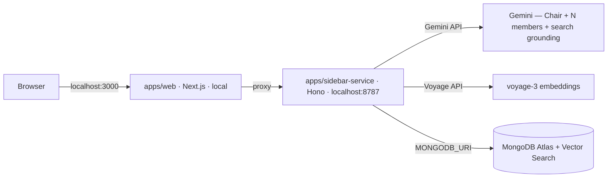

# 01 — Architecture & Repo Layout

## Deployment topology

**Local-first: no web hosting in v1.** Both apps run on the demo laptop via `pnpm dev`; the only cloud pieces are MongoDB Atlas and the model/embedding APIs.



- **`apps/web`** (local Next.js): intake, live courtroom, replay pages. ALL data (live SSE and finished-session reads) flows through Next.js route handler proxies to the sidebar service — one code path, and the app is host-ready if it's ever deployed later.
- **`apps/sidebar-service`** (local Hono on :8787): runs deliberations, streams SSE, and serves the read endpoints for finished sessions (`GET /sessions/:id`, `GET /sessions/:id/events`). A separate process (not Next API routes) so a 60–90s streaming session never fights the web app, and the service is deployable unchanged later.
- **MongoDB Atlas** (free M0, cloud): persona library (Atlas Vector Search), session persistence, event replay log. Only the sidebar service holds `MONGODB_URI`; the frontend never reads the DB directly (spec 03 §Access policy). Offline fallback: Atlas CLI local deployment supports vector search on-laptop.
- **Model calls**: Gemini (`@google/genai`) from the sidebar service only. No model calls from the frontend.

## Monorepo layout (pnpm workspace)

```
jury/
├── pnpm-workspace.yaml
├── package.json
├── .env.example                  # every env var, documented (see spec 09)
├── apps/
│   ├── web/                      # P3 — Next.js 15, Tailwind, Framer Motion
│   │   ├── app/
│   │   │   ├── page.tsx          # home: orb field + search + intake ("file your case")
│   │   │   ├── session/[id]/     # live HQ (SSE)
│   │   │   ├── replay/[id]/      # finished-session replay (via read-endpoint proxy)
│   │   │   ├── dev/replay/       # fixture replay harness (frontend task 3)
│   │   │   └── api/sessions/     # proxy routes → sidebar-service
│   │   ├── components/
│   │   │   ├── hq/               # Chair, ConsoleSeat, Blob (SVG character), SpeechBubble,
│   │   │   │                     #   ToolChip, PhaseTracker, PersonaCard, OrbField, SearchBar
│   │   │   ├── verdict/          # VoteSplit, SolutionPlan, DissentSpotlight, BriefExport, Crystallize
│   │   │   ├── sidebar/          # VectorGraph (2D personality embeddings, hover summaries)
│   │   │   └── intake/
│   │   └── lib/
│   │       ├── sse-client.ts     # reconnect + Last-Event-ID resume
│   │       ├── session-store.ts  # single reducer: contract events → HQ state
│   │       └── blobs.ts          # 12-hue palette + SVG form set (characters are code, not assets)
│   └── sidebar-service/          # P4 scaffold, P1 chair, P2 casting
│       ├── src/
│       │   ├── index.ts          # Hono app: POST /sessions, GET /sessions/:id/stream,
│       │   │                     #   GET /sessions/:id, GET /sessions/:id/events (replay reads)
│       │   ├── auth.ts           # bearer token check
│       │   ├── chair/            # P1
│       │   │   ├── state-machine.ts
│       │   │   ├── orchestrator.ts
│       │   │   ├── models.ts     # model registry + capability routing (spec 04); model-matrix.json
│       │   │   └── prompts/      # intake.ts, brief.ts, statement.ts, rebuttal.ts, closing.ts, verdict.ts
│       │   ├── models/           # P4 — provider adapters behind one interface (spec 04):
│       │   │                     #   gemini.ts, anthropic.ts, openai.ts
│       │   ├── casting/          # P2
│       │   │   ├── retrieve.ts   # Atlas $vectorSearch top-K
│       │   │   ├── mmr.ts        # pure function, unit-tested
│       │   │   ├── diversity.ts  # score + baseline
│       │   │   └── project.ts    # 2D PCA → VectorPoint[] for the sidebar graph
│       │   ├── tools/            # P4 — web-search.ts, calculator.ts (spec 06)
│       │   ├── events/           # emitter.ts, persist.ts, replay.ts
│       │   └── db/               # mongo client + typed collection helpers
│       └── test/
├── packages/
│   └── contract/                 # P4 pen, all sign — THE hour-0 deliverable
│       └── src/                  # events.ts, stance.ts, verdict.ts, persona.ts, phases.ts (zod)
├── seed/                         # P2 — offline, one-time
│   ├── generate-personas.ts      # LLM generation w/ quality rubric
│   ├── embed-personas.ts         # voyage-3 batch
│   ├── load-mongo.ts             # insert personas into Atlas
│   └── setup-indexes.ts          # idempotent: vector search + standard indexes (P4)
├── fixtures/
│   └── golden-session.jsonl      # recorded event streams (P3 dev + demo mode)
├── eval/                         # P1 — spec 08
│   ├── benchmark-dilemmas.json   # fixed 20-dilemma set
│   ├── run-eval.ts
│   └── rubrics/
├── specs/                        # these documents
└── tasks/                        # per-person breakdowns
```

## Rules that keep four people unblocked

1. **Ownership is by directory.** P1 = `chair/` + `eval/`; P2 = `casting/` + `seed/`; P3 = `apps/web/`; P4 = everything else. PRs touching someone else's directory need their review.
2. **`packages/contract` is the only shared code.** Changing it after hour 0 requires all-four sign-off (see specs/README change protocol).
3. **Frontend consumes fixtures, not the backend,** until the hour-12 checkpoint.
4. **No cross-imports between `chair/`, `casting/`, `tools/`** — they meet only through the interfaces in spec 04/05/06 and the contract types.
