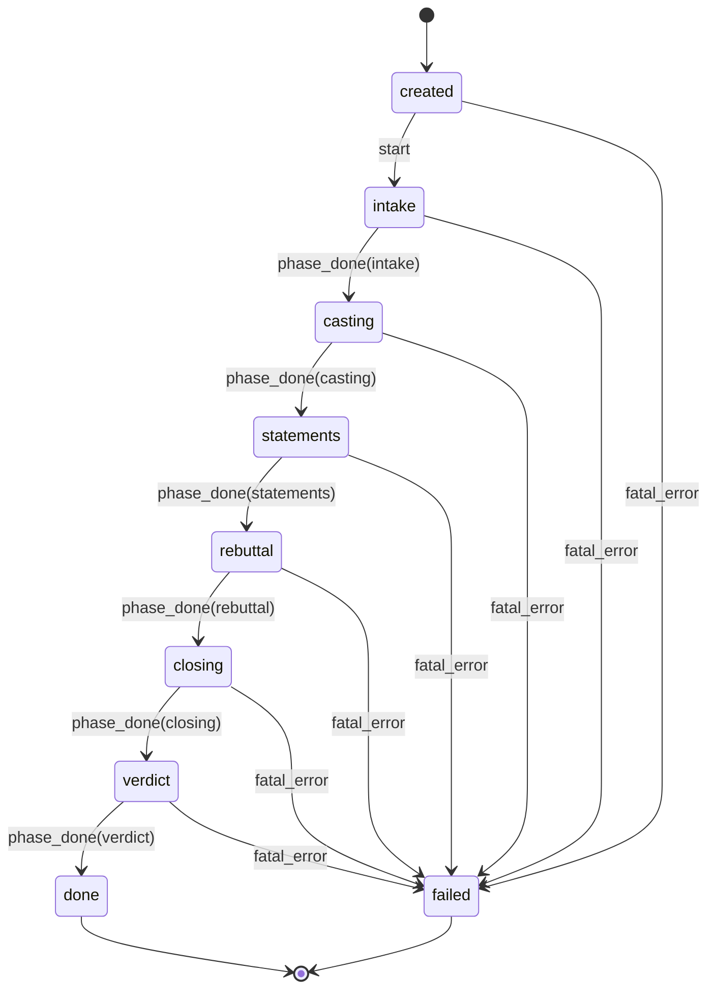

# P1 — Deliberation State Machine

Implementation: [`apps/sidebar-service/src/chair/state-machine.ts`](../apps/sidebar-service/src/chair/state-machine.ts).
Spec: [`specs/04-deliberation-engine.md`](../specs/04-deliberation-engine.md) §State machine.

## Non-fatal degradation (recusal path)

During `statements` or `rebuttal`, an individual member timeout/error does **not**
fail the session — it emits `agent_recused` and the phase continues with the
remaining members.

- Minimum viable sidebar: **2 active members**.
- If recusals drop the active count below 2, that *is* a fatal error for the
  session (`shouldFailFromRecusals` in `state-machine.ts`).

This degradation happens *within* a phase (which members participate), not at
the phase-transition level above — the orchestrator (spec 04 task 9) is what
calls `shouldFailFromRecusals` after each recusal and raises a `fatal_error`
event into the state machine if the sidebar has fallen below the minimum.
